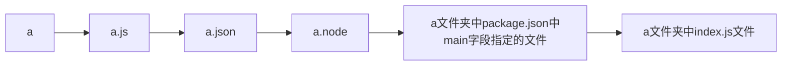

## 使用

package.json 包管理文件
(用来记录与项目有关的一些配置信息)

```bash
npm init # 初始化一个包管理文件，可以输入一些配置信息

npm init -y # 初始化一个默认的包管理文件(一键默认生成)，目录名字不要有中文，不要包含特殊字符

npm init --yes # 和上面等价

{
  "name": "ifyuki", # 项目(包)名称
  "version": "1.1.0", # 项目版本号
  "main": "index.js", # 入口文件，一般是index.js 导入模块时 会自动搜索main
  "description": "提供了格式化时间、HTMLEscape相关的功能", # 项目描述信息
  "scripts": { #指定了运行脚本命令的npm命令缩写,默认是空的test
    "test": "echo \"Error: no test specified\" && exit 1"
  },
  "keywords": [ # 搜索关键字
    "yuki",
    "dateFormat",
    "escape"
  ],
  "author": "yuki", # 作者
  "license": "ISC", #许可证,默认是ISC、有的默认是MIT
   "dependencies": { # 安装项目依赖包
    "moment": "^2.29.1"
  }
}

# npm run 可列出package.json中scripts的所有脚本命令
# npm run test 就会执行：echo "Error: no test specified" && exit 1
```

```bash
npm i moment mime # 安装多个包

# npm i moment mime --save # 和上面等价

# npm i moment mime -S # 和上面等价

npm i # 同事拿到没有 node_modules 的代码后，只需要执行这个命令就能安装所有依赖的包

npm uninstall moment # 卸载包

npm i --production # 只安装核心生产依赖/项目依赖包

npm i gulp -D # 安装到开发依赖（开发的时候才会用到）

# npm i gulp --save-dev # 和上面等价
```

## 切换源到淘宝镜像

```bash
npm i nrm -g # nrm 是一个源管理工具，-g 代表全局安装

nrm -V # 查看 nrm 是否安装成功

nrm use taobao # 切换 npm 的源（下载地址）到淘宝镜像

nrm ls # 查看处于哪个下载地址

npm i mime # 以后再用 npm 下载包就是从淘宝服务器下载的，就快了
```

## 包的存在形式

项目包：项目需要使用到的（开发依赖包和生产依赖包）

全局包：作为命令行工具存在的
在执行 npm install 命令时，如果提供了 -g 参数，则会把包安装为全局包。
全局包会被安装到 C:\Users\用户目录\AppData\Roaming\npm\node_modules 目录下。
注意：
① 只有工具性质的包，才有全局安装的必要性。因为它们提供了好用的终端命令。
② 判断某个包是否需要全局安装后才能使用，可以参考官方提供的使用说明即可。

```bash
npm i nrm -g # 安装全局包
npm uninstall nrm -g # 卸载全局包

npm i i5ting_toc -g
i5ting_toc --version
i5ting_toc -f 总结.md -o # 转换 总结.md 为 HTML 文件并自动打开
```

```bash
npm i nodemon -g # 自动刷新挂起
nodemon -v

nodemon test.js # 自动监听 test.js 文件的变化，并执行
```

## npm 发布

```bash
1. 注册账号，记得去邮箱里面激活后方能使用

2. 切换本地的源为 npm，`nrm use npm`

3. `npm login`，输入账号和密码

4. `npm publish`，要确保处于包的根目录

# `npm unpublish 包名 --force` 命令，既可以从npm删除已发布的包 该命令只能删除72小时以内发布的包
```

## 加载规则

1\. 带路径(自定义模块加载机制)

```js
require('./a')
```

==按照确切的文件名进行加载==



**目录作为模块**

```bash
当把目录作为模块标识符，传递给 'require()' 进行加载的时候，有三种加载方式：
① 在被加载的目录下查找一个叫做 'package.json' 的文件，并寻找 'main' 属性，作为 'require()' 加载的入口
② 如果目录里没有 'package.json' 文件，或者 'main' 入口不存在或无法解析，则 'Node.js' 将会试图加载目录下的 'index.js' 文件。
③ 如果以上两步都失败了，则 'Node.js' 会在终端打印错误消息，报告模块的缺失：Error: Cannot find module 'xxx'
```

2\. 不带路径(第三方模块加载机制)

```js
require('mime')
```

==如果没有找到对应的第三方模块，则移动到再上一层父目录中，进行加载，直到文件系统的根目录。==


## Express

**Express 简介**

```bash
# 思考：不使用 Express 能否创建 Web 服务器？
# 答案：能，使用 Node.js 提供的原生 http 模块即可。

# 思考：既生瑜何生亮（有了 http 内置模块，为什么还有用 Express）？
# 答案：http 内置模块用起来很复杂，开发效率低；Express 是基于内置的 http 模块进一步封装出来的，能够极大的提高开发效率。

# 思考：http 内置模块与 Express 是什么关系？
# 答案：类似于浏览器中 Web API 和 jQuery 的关系。后者是基于前者进一步封装出来的。

使用 Express，我们可以方便、快速的创建 Web 网站的服务器或 API 接口的服务器。

// Web 网站服务器：专门对外提供 Web 网页资源的服务器。
// API 接口服务器：专门对外提供 API 接口的服务器。
```

**监听 GET 请求、POST 请求**

通过 `app.get()/app.post()` 方法，可以监听客户端的 GET 请求、POST 请求，语法格式如下:
通过 `res.send()` 方法 把内容**响应**给客户端

```js
// 参数1：客户端请求的 URL 地址
// 参数2：请求对应的处理函数
//req：请求对象(包含了与请求相关的属性与方法)
//res：响应对象(包含了与响应相关的属性与方法)

app.get('请求URL', function (req, res) {
    /*处理函数*/
    // 向客户端发送 JSON 对象
    res.send({ name: 'zs', age: 20, gender: '男' })
    // 通过 res.send() 方法，可以把处理好的内容，发送给客户端(把内容响应给客户端)
})

app.post('请求URL', function (req, res) {
    /*处理函数*/
    // 向客户端发送文本内容
    res.send('请求成功)
})
```

```js
// #1 引入 express
const express = require('express')

// #2 创建一个 web 服务器对象实例
const app = express()

// #3 监听 请求地址是 / 的 GET 请求
app.get('/', (req, res) => {
    // send 会根据响应的内容自动设置对应Content-type和编码
    res.send({
        name: 'ifer'
    })
})
app.get('/html', (req, res) => {
    res.send('<h1>h</h1>')
})

// 监听 请求地址是 / 的 POST 请求
app.post('/', (req, res) => {
    res.send('POST 请求')
})

app.get('/news', (req, res) => {
    res.end('news')
})

// #4 调用 app.listen 设置(端口号,启动成功后的回调函数) 启动服务器
app.listen(3000, () => console.log('Server running on http://localhost:3000'))
```
**获取 URL 中携带的查询参数**
通过 req.query 对象，可以访问到客户端通过查询字符串的形式，发送到服务器的参数：

```js
app.get('/',(req,res)=>{
    // 通过 req.query 可以获取到客户端发送过来的 查询参数
    // 注意：默认情况下，req.query 默认是一个空对象
    // 客户端使用 ?name=zs&age=20 这种查询字符串形式,发送到服务器的参数
    // 可以通过 req.query 对象访问到,例如:
    // req.query.name req.query.age
    console.log(req.query)
    res.send(req.query)
})
```

```js
// 获取 GET 查询参数
req.query

// 等价于
const url = require('url')
const { query } = url.parse(req.url, true)
```

**获取 URL 中的动态参数**

通过 `req.params` 对象，可以访问到 URL 中，通过 `:`匹配到的动态参数：

```js
// URL 地址中,可以通过 :参数名(参数名可任意取) 的形式,匹配动态参数值
// 注意：这里的 :id 是一个动态的参数
app.get('/:id',(req,res)=>{
    // req.params 默认是一个空对象
    // 里面存放着通过 : 动态匹配到的参数值
    console.log(req.params)
    res.send(req.params)
})
// 可以有多个动态参数
// 在这里'/:ids/:usname' 代表需要传递两个参数
app.get('/:ids/:usname',(req,res)=>{
    // req.params 默认是一个空对象
    // 里面存放着通过 : 动态匹配到的参数值
    console.log(req.params)
    res.send(req.params)
})
```
**托管静态资源 express.static()**
 express.static()，通过它，我们可以非常方便地创建一个静态资源服务器，
例如，通过如下代码就可以将 public 目录下的图片、CSS 文件、JavaScript 文件对外开放访问了：
```js
// app.use(express.static('指定目录')) 去指定需要把哪个目录作为我们的静态资源的文件夹给它向外托管出去

app.use(express.static('public'))
// 只要指定了这个目录 以后就可以在外界来访问目录里面的所有资源(所有的文件)

//注意：Express 在指定的静态目录中查找文件，并对外提供资源的访问路径。
// 因此，存放静态文件的目录名不会出现在 URL 中

```

